# school-management-system(SMS)
Many School Mangers and Principal have been lacking the opportunity to manage their administrative activities using technological advancements such as Mobile Phones, Tablets, Computers and Internet. Currently it is difficult for School Mangers and Principals to know in real time how many students are attending classes, the Parents’ contact details of each student, or generating reports on school fee payments for each student. These are just some of the many solutions we are providing with our  School Management System.


:loudspeaker:
**New application with php7, laravel 5.6 and new theme is [here](https://github.com/hrshadhin/school-management-system/tree/v2.0-dev)**

## Installation and use
# SMS is build using Laravel 4.2
```
$ git clone https://github.com/hrshadhin/school-management-system.git
```
```
$ cd school-management-system
```

**Change configuration according your need and create Database**
```
$ composer install
```
```
$ php artisan migrate
```
```
$ php artisan db:seed
```
```
$ php artisan serve
```
**  http://localhost:8000 **
USER: admin
PASS: demo123

# Demo Live Link
URL: http://school.hrshadhin.me
USER: admin
PASS: demo123

:information_desk_person:
**About SMS Sending**
- If you configure api link [here](https://github.com/hrshadhin/school-management-system/blob/master/app/controllers/attendanceController.php#L221) then sms will be send to the number.
- If you want to send bulk sms from the menu you have to congifure api link
    also in [here](https://github.com/hrshadhin/school-management-system/blob/master/app/controllers/smsController.php#L179). Bulk sms will not send currently it store in queue inside the database
    so you have process that queue. For that you can set a cron job with below command:
    ```
    php artisan queue:listen
    ```
 
 ## Contributors ##
 - [Habibur Rahman Shadhin](https://github.com/hrshadhin)
 - [order4adwriter](https://github.com/order4adwriter)
 - [Ashutosh Das](https://github.com/pyprism)
 - [Zahid Irfan](https://github.com/zahidirfan)
 
 
# Screenshot

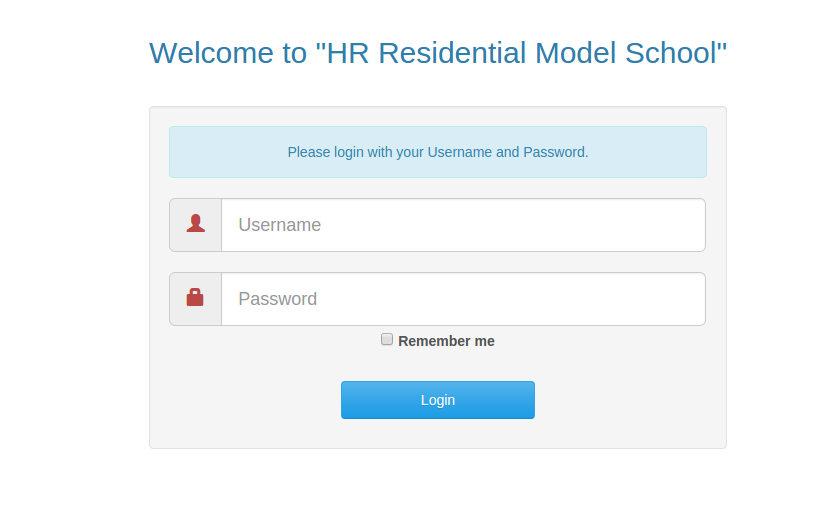
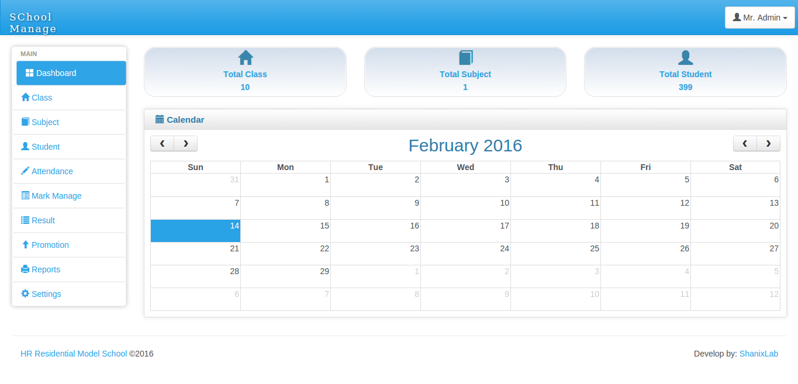
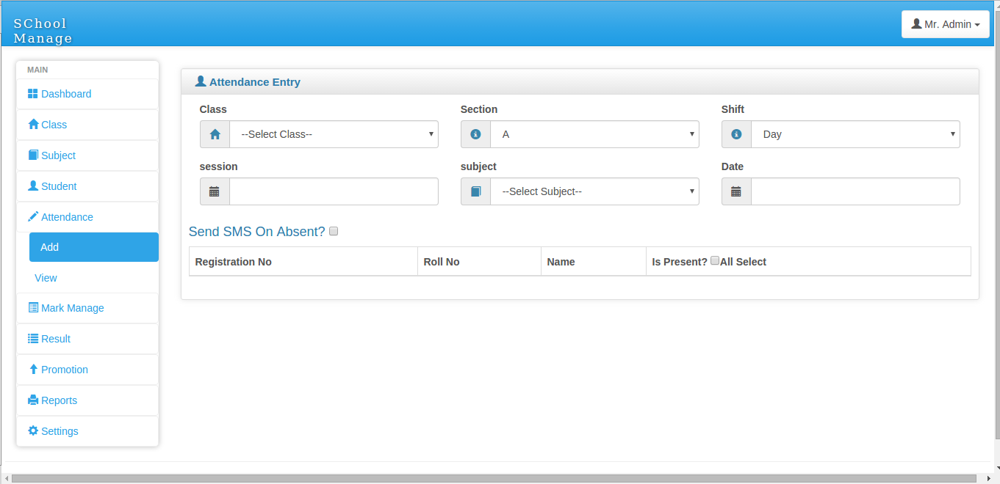
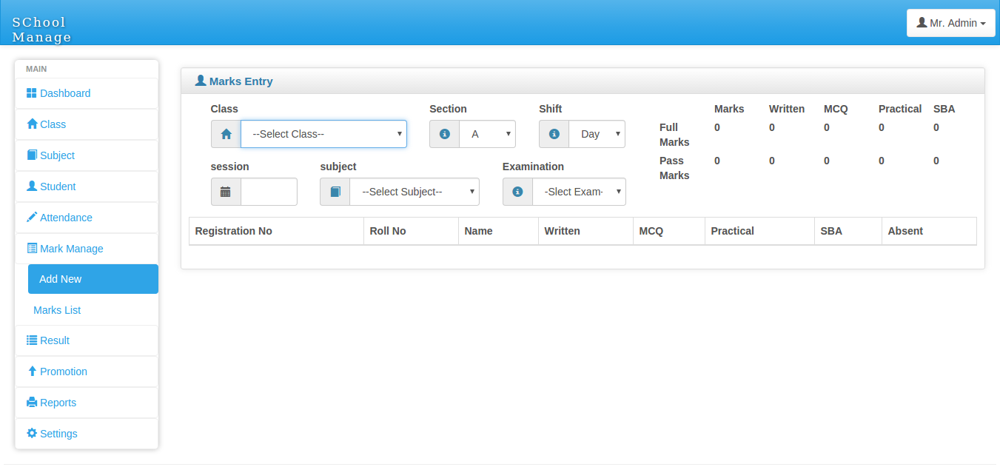
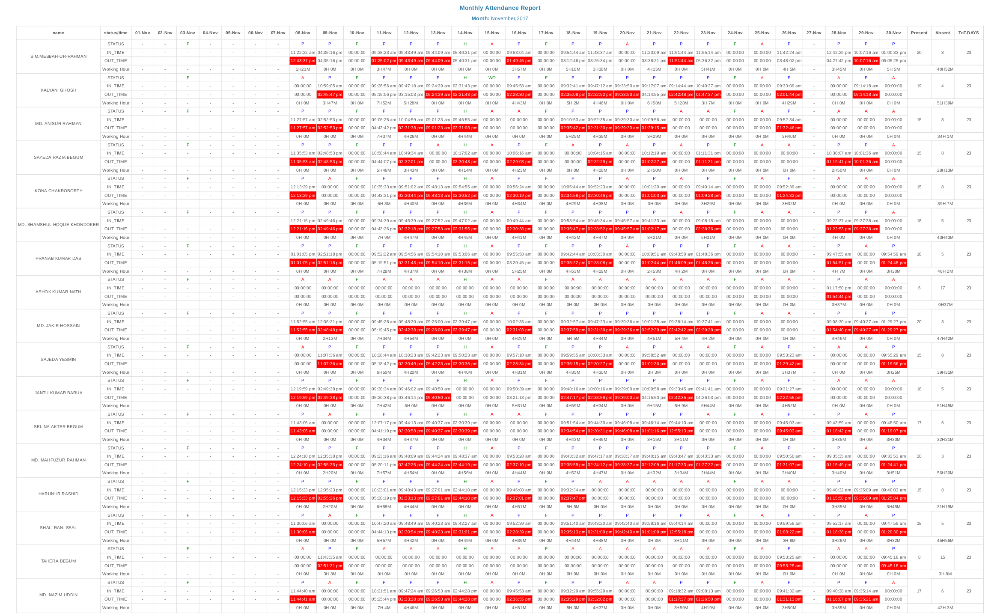
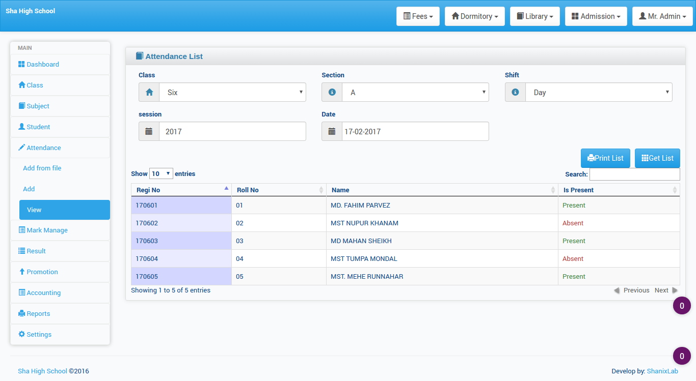
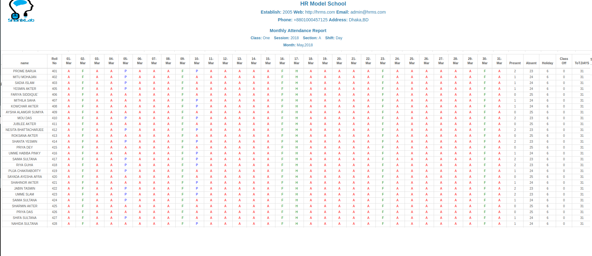
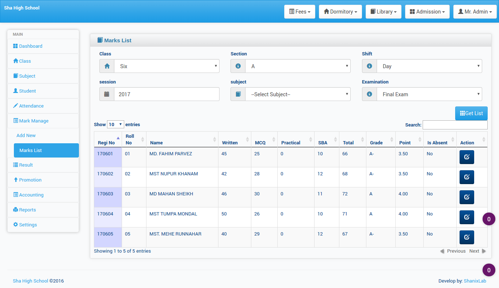
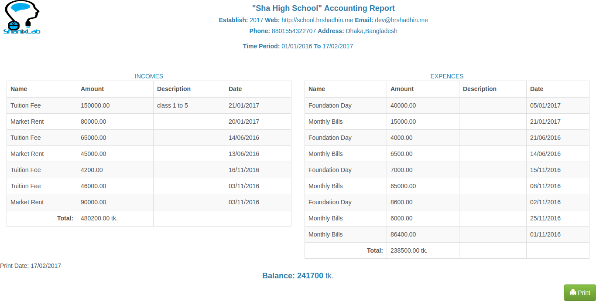
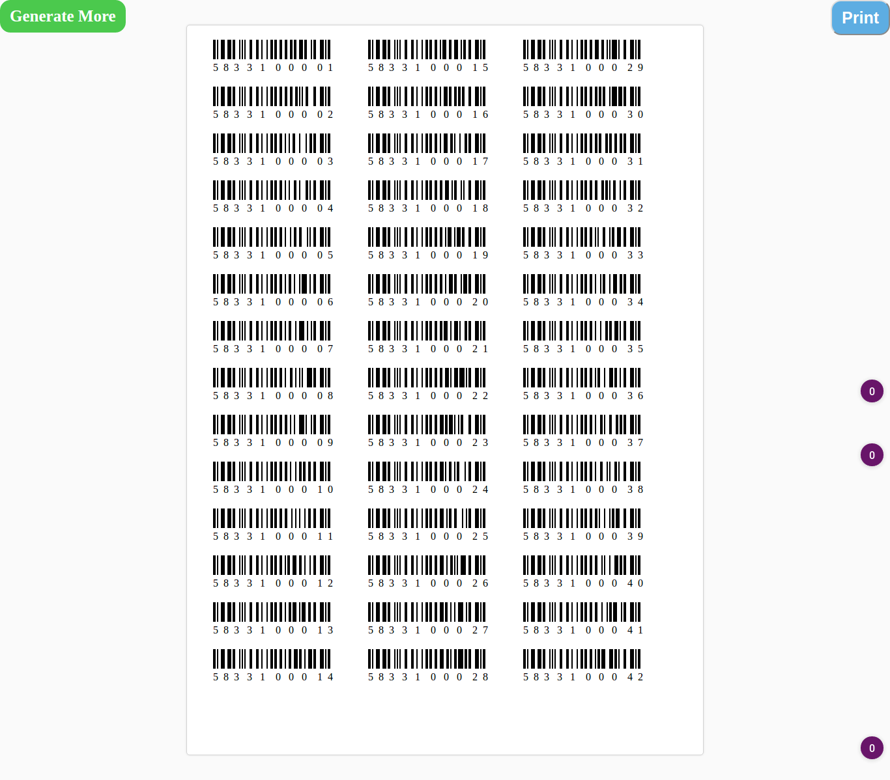
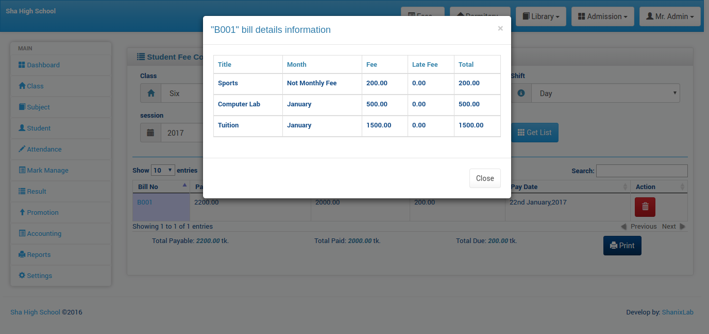
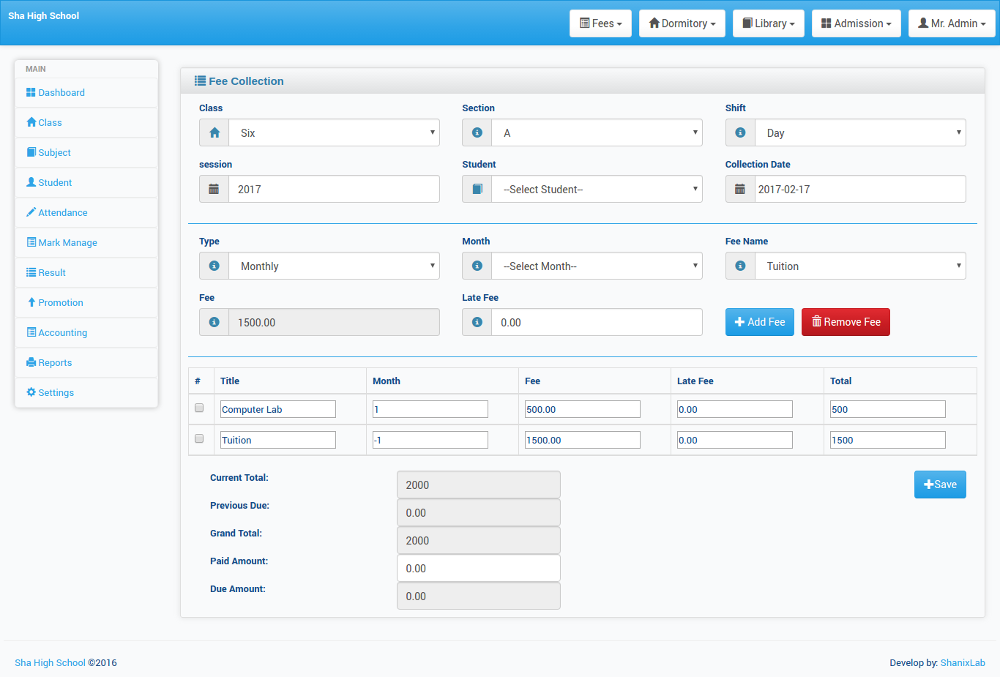
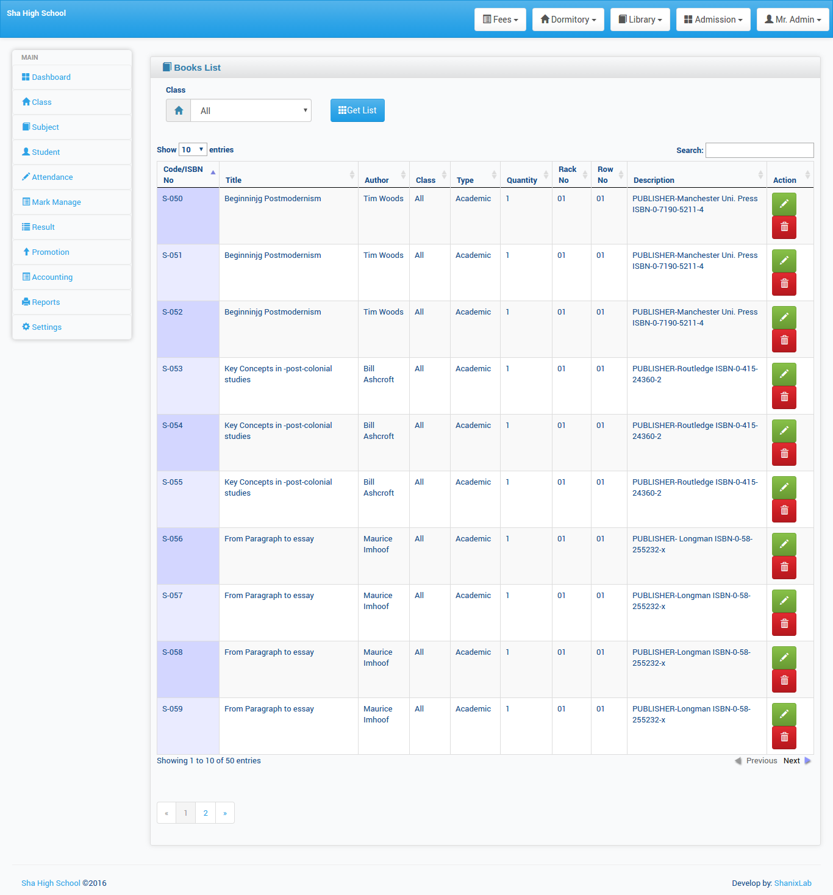
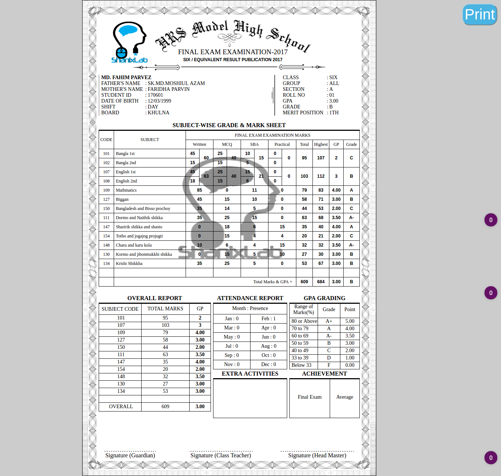
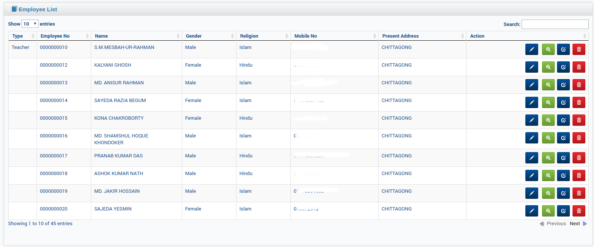
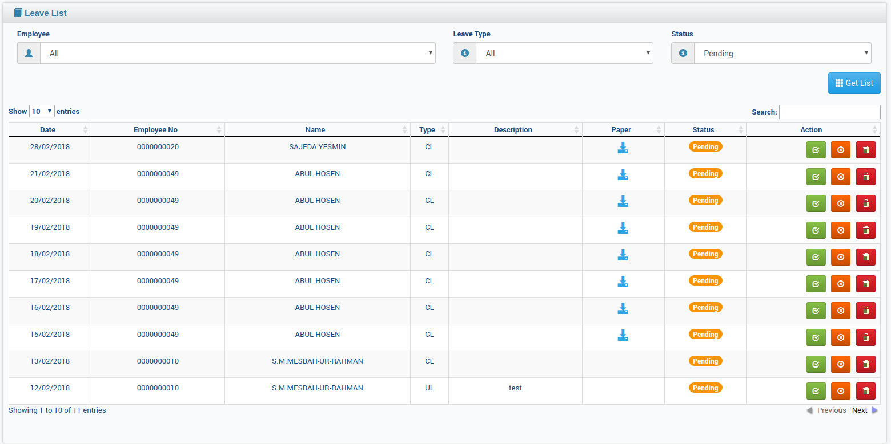
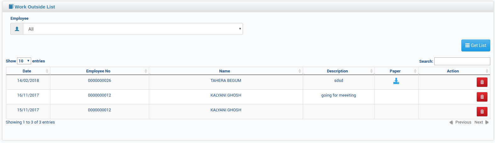
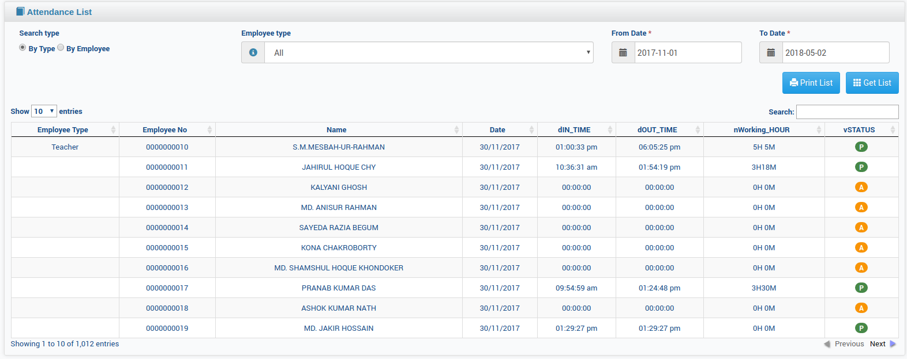

# License
SMS is open-sourced software licensed under the AGPL-3.0 license. Frameworks and libraries has it own licensed
