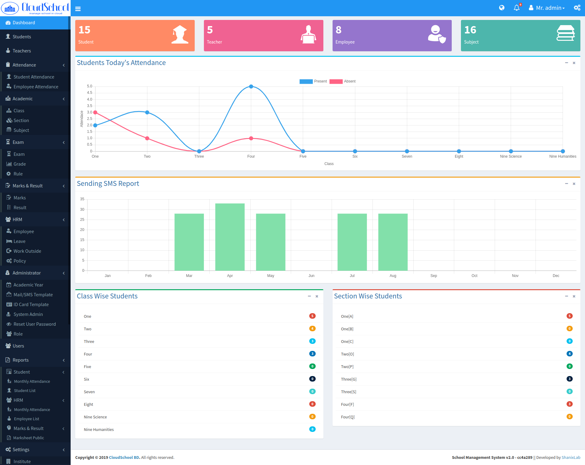
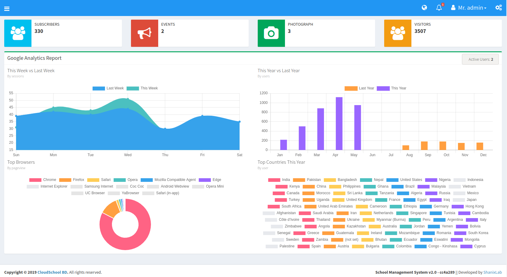
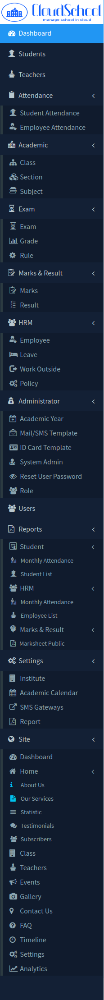
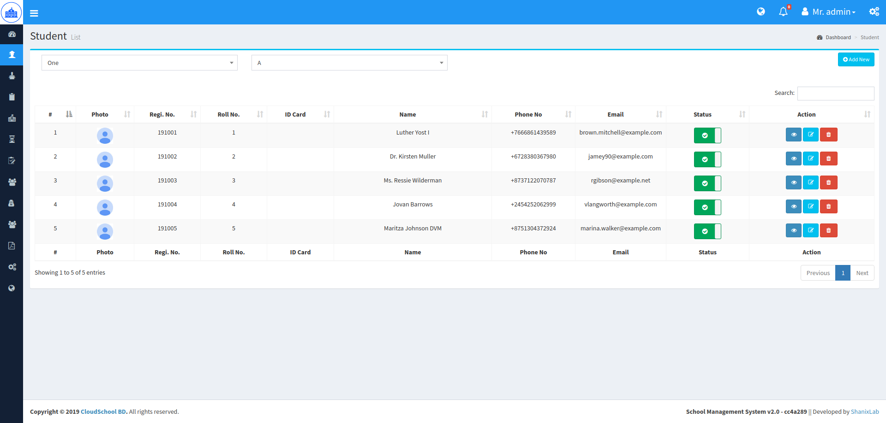
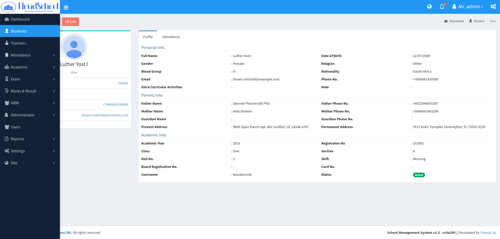
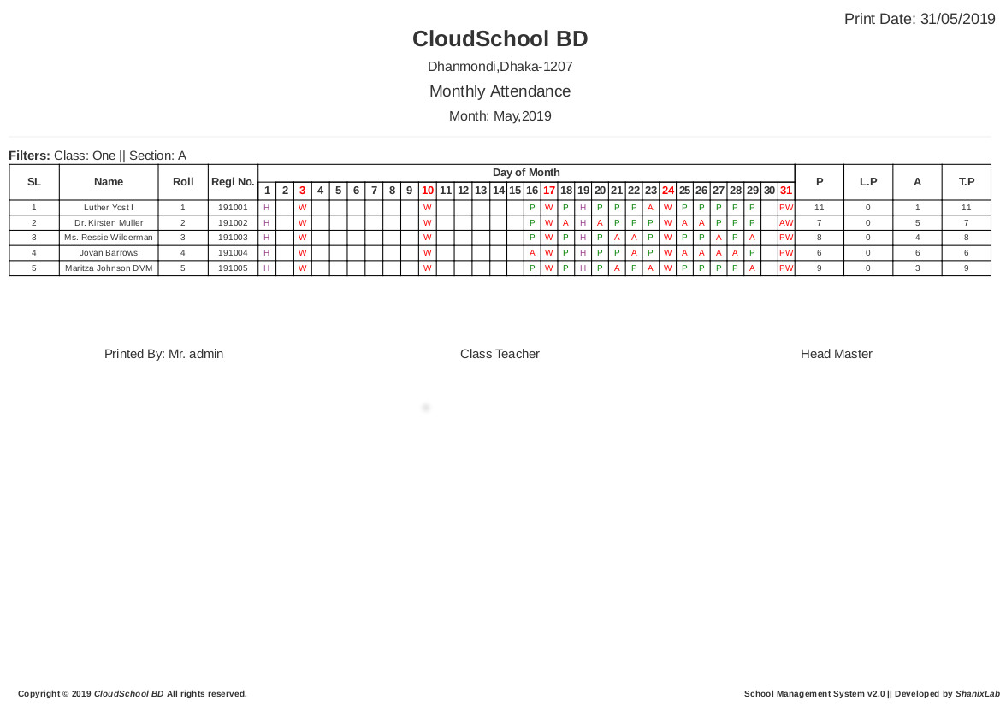
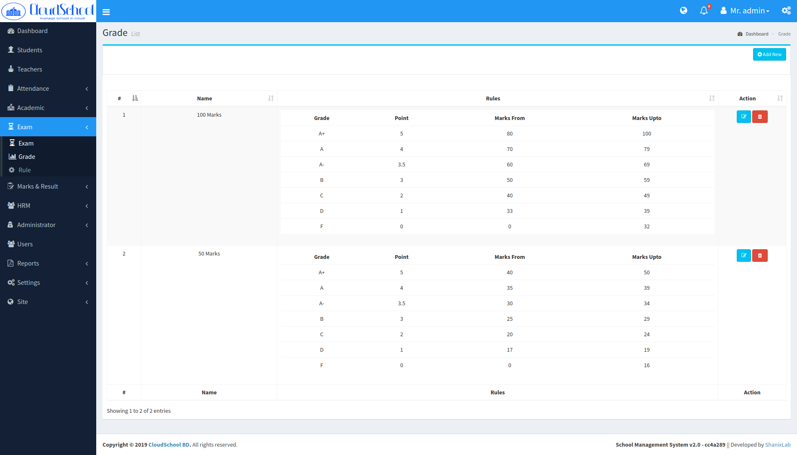
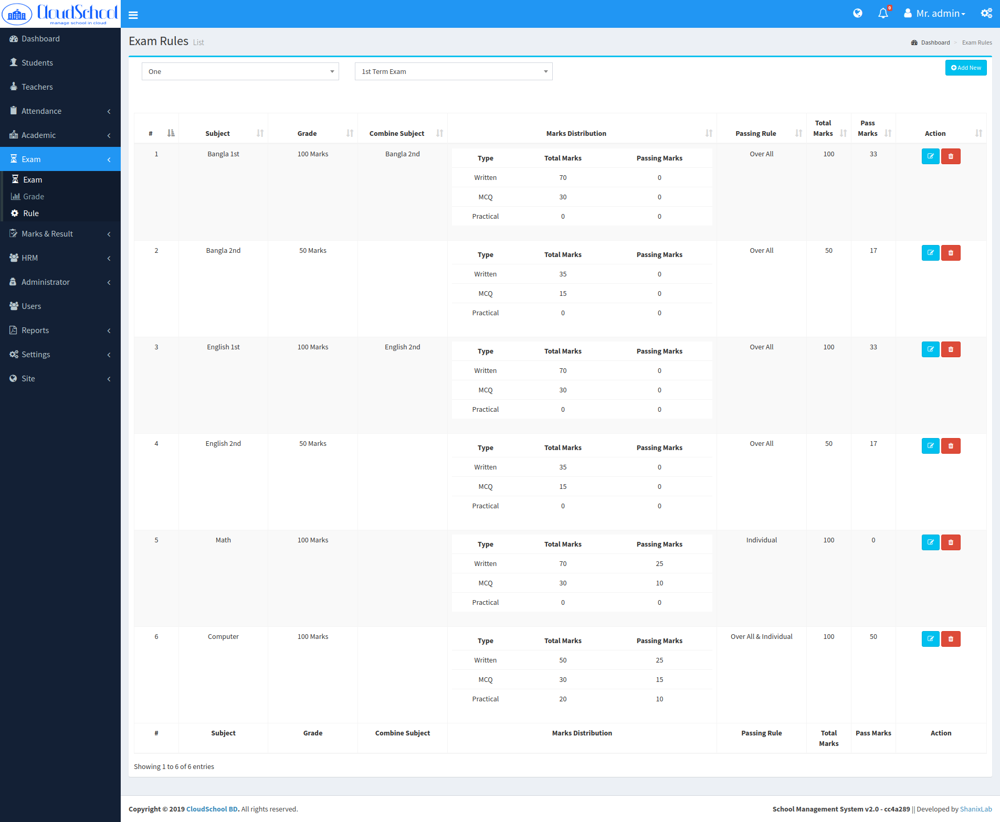
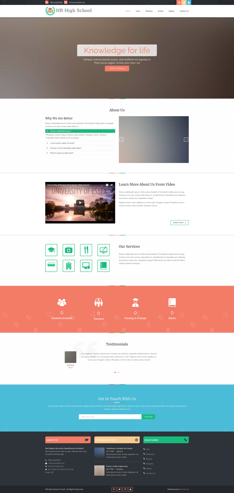

# school Management System (SMS)
Another School Management System build with laravel and PHP 7.

[](https://app.codeship.com/projects/312233)
[](https://www.gnu.org/licenses/agpl-3.0)
[](https://snyk.io/test/github/hrshadhin/school-management-system?targetFile=package.json)


:loudspeaker:
**Notic:**  Now its version [v2.0](https://github.com/hrshadhin/school-management-system/releases/tag/v2.0) (community edition)
. If you need PHP 5 support then use version [v1.0](https://github.com/hrshadhin/school-management-system/releases/tag/v1.0).
For Enterprise edition checkout here [EE](https://github.com/hrshadhin/school-management-system/tree/empty)

# Join Our Discord Server
:mega:[CloudSchool](https://discord.gg/7rXyuu8):mega:

# Features
|   Community Edition   |   Enterprise Edition   |
|-----------------------|:-------------------------:|
| Academic Year manage  | Academic Year manage   |
| Academic Calendar Setup | Academic Calendar Setup |
| Institute Setup | Institute Setup |
| Class & Section Manage | Class & Section Manage |
| Subject & Teacher Manage | Subject & Teacher Manage |
| Student Admission | Student Admission |
| Student Attendance |  Student Attendance |
| Exam & Grading Rules | Exam & Grading Rules |
| Makrs & Result | Easy Makrs Entry & Result Manage |
| Employees Manage | Employees Manage |
| Employees Attendance | Employees Attendance | 
| Employees Leave | Employees Leave |
| Employees Work Outside | Employees Work Outside |
| SMS Gateway Setup  | SMS Gateway Setup |
| Email & SMS Templating  | Email & SMS Templating |
| Attendance notification email/sms  | Attendance notification email/sms |
| Id Card templates Manage | Id Card templates Manage |
| Employee & Student id card print | Employee & Student id card print |
| User & Role manage with permision grid(ACL) | User & Role manage with permision grid(ACL) |
| User wise Dashboard | User wise Dashboard
| Report Settings | Report Settings |
| Only 5 Reports | **40+** Reports |
| Dynamic Front Website | Dynamic Front Website |
| Website Management Panel |  Website Management Panel
| Photo Gallery | Photo Gallery | 
| Event Manage | Event Manage |
| Google Analytics | Google Analytics |
| User Notification | User Notification |
|                   | Online Admission |
|                   | Online Admit Card & Payslip |
|                   | Student Promotion |
|                   | Notice Board |
|                   | Student & Employee Id card bulk/mass print |
|                   | Account Manage |
|                   | Budget Manage |
|                   | Account Heads |
|                   | Student Invoice |
|                   | Income / Expense Manage |
|                   | Payroll |
|                   | Salary Template |
|                   | Employee Salary Payment |
|                   | Hostel & Collection Manage |
|                   | Library Manage |
|                   | Issue book and fine collection |
|                   | Academic Calendar Print |
|                   | Bulk SMS and Email Sending |
|                   | **40+** Reports |

# Installation and use

**Dependency**
- PHP >= 7.1.3
- OpenSSL PHP Extension
- PDO PHP Extension
- Mbstring PHP Extension
- Tokenizer PHP Extension
- XML PHP Extension
- Ctype PHP Extension
- JSON PHP Extension
- [hrshadhin/laravel-userstamps](https://github.com/hrshadhin/laravel-userstamps.git)
- NodeJS, npm, webpack


```
$ git clone https://github.com/hrshadhin/school-management-system.git

```
```
$ cd school-management-system
```
```
$ cp .env.example .env
```
**Change configuration according to your need in ".env" file and create Database**
```
$ composer install
```
```
$ php artisan migrate
```
```
$ php artisan db:seed
```
**Load demo data**
```
$ php artisan db:seed --class DemoSiteDataSeeder
```
```
$ php artisan db:seed --class DemoAppDataSeeder
```
**Clear cache**
```
$ sudo php artisan cache:clear
```
```
$ npm install
```
```
$ npm run backend-prod
```
```
$ npm run frontend-prod
```
```
$ php artisan storage:link
```
```
$ php artisan serve
```
Now visit and login: [http://localhost:8000](http://localhost:8000) \
username: admin\
password: demo123

**Demo(Community Edition)**\
website url: http://sms.hrshadhin.me \
app login: http://sms.hrshadhin.me/login \
username: admin\
password: demo123

**Demo(Enterprise Edition)**\
website url: http://cloudschoolbd.com \
app login: http://cloudschoolbd.com/login \
username: admin\
password: demo123

**N.B:**
- For sms and email processing you need to run laravel queue worker. `bin` folder has supervisor config for start queue worker with supervisor.

# Screenshot












# Security Vulnerabilities

If you discover a security vulnerability within SMS, please send an e-mail to H.R. Shadhin via [dev@hrshadhin.me](mailto:dev@hrshadhin.me). All security vulnerabilities will be promptly addressed.

# License

SMS is open-sourced software licensed under the AGPL-3.0 license. Frameworks and libraries has it own licensed.
