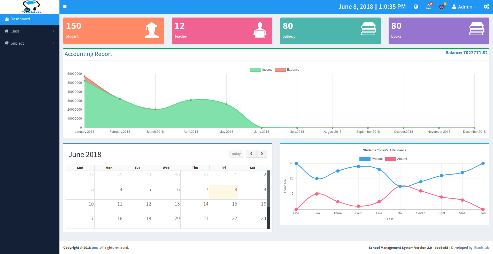

# school-management-system(SMS)
Another School Management System build with laravel and PHP 7.


:loudspeaker:
**Notic:** This branch is under development all features are not complete yet! so don't use it in production.
if you need production use please wait for completion of the project or use version [v1.0](https://github.com/hrshadhin/school-management-system/releases/tag/v1.0).

# Features
- Application
- Admission
- Attendance
- Exam
- Result
- Certificate
- Fees
- Accounting
- Library
- Hostel
- Employees
- Leave manage
- Reports
- Front-end website

# Installation and use

## Dependency
- PHP >= 7.1.3
- OpenSSL PHP Extension
- PDO PHP Extension
- Mbstring PHP Extension
- Tokenizer PHP Extension
- XML PHP Extension
- Ctype PHP Extension
- JSON PHP Extension
- [hrshadhin/laravel-userstamps](https://github.com/hrshadhin/laravel-userstamps.git)
- NodeJS, npm, webpack


```
$ git clone https://github.com/hrshadhin/school-management-system.git -b v2.0-dev --single-branch
```
```
$ cd school-management-system
```
```
$ cp .env.example .env
```
**Change configuration according to your need in ".env" file and create Database**
```
$ composer install
```
```
$ php artisan migrate
```
```
$ php artisan db:seed
```
```
$ npm install
```
```
$ npm run production
```
or
```
$ npm run development
```
```
$ php artisan serve
```
Now visit and login: http://localhost:8000 \
username: admin\
password: demo123

# Demo Live Link
url: http://sms.hrshadhin.me \
username: admin\
password: demo123

# Screenshot
## Back Panel


## Front website


# Security Vulnerabilities

If you discover a security vulnerability within SMS, please send an e-mail to H.R. Shadhin via [hello@hrshadhin.me](mailto:hello@hrshadhin.me). All security vulnerabilities will be promptly addressed.

# License

SMS is open-sourced software licensed under the AGPL-3.0 license. Frameworks and libraries has it own licensed
